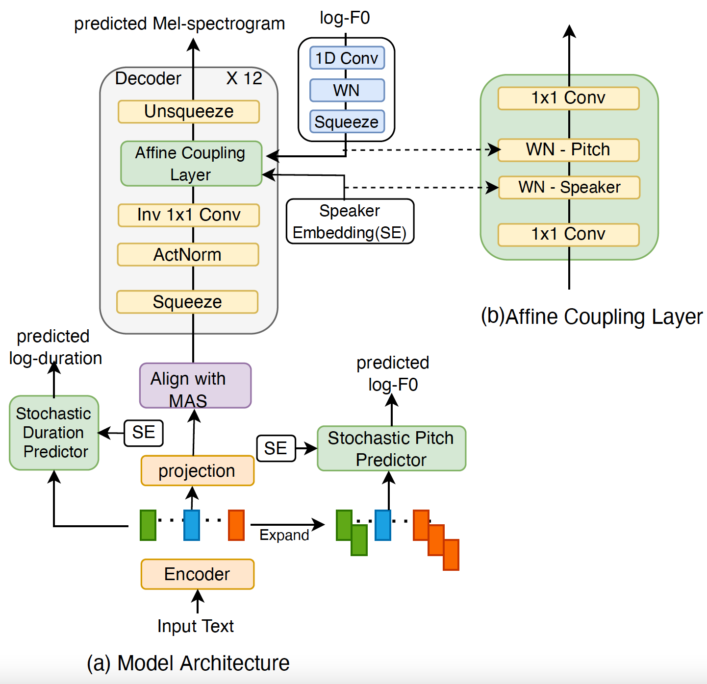

# Stochastic Pitch Prediction Improves the Diversity and Naturalness of Speech in Glow-TTS

### Sewade Ogun, Vincent Colotte, Emmanuel Vincent

In our recent [paper](https://arxiv.org/abs/2305.17724), we proposed GlowTTS-STDP, a flow-based TTS model that improves the naturalness and diversity of generated utterances.


<table style="width:100%">
  <tr>
    <th>Glow-TTS-STDP at Inference</th>
  </tr>
  <tr>
    <td></td>
  </tr>
</table>


## 2. Requirements

Our model is based on the GlowTTS architecture which we implemented in the NeMo toolkit. You have to install the same version of NeMo used in our experiments in order to ensure all dependencies work correctly.

```bash
    apt-get update && apt-get install -y libsndfile1 ffmpeg
    git clone https://github.com/NVIDIA/NeMo
    cd NeMo
    git checkout v1.5.0
    ./reinstall.sh
```

After installation, you should have;
1) NeMo toolkit (version 1.5.0), [https://github.com/NVIDIA/NeMo](https://github.com/NVIDIA/NeMo)
2) Pytorch 1.10.0 or above
3) Pytorch Lightning


GPUs are required for model training. Kindly note that we used mixed-precision training for all our experiments.

PS: Checkout the NeMo github page if you have problems with the library installations.

## 2. Model setup

Clone this github repo after installing NeMo and changing to the correct branch successfully. This repo contains;
i.  the model,
ii. the dataset (without the audio files),
iii. the training scripts,
iv. configuration files for all the experiments

```bash
    git clone https://github.com/ogunlao/glowtts_stdp
```

## 2. Pre-requisites

a) Download and extract [the English subset of Common Voice Version 7.0](https://commonvoice.mozilla.org/en/datasets) into the `dataset` directory. Convert the files from mp3 to wav, and resample the files to 16 kHz for faster data loading. The training and validation json files, which contains [CommonVoice WV-MOS-4.0-all](https://arxiv.org/abs/2210.06370) has been provided.

b) A HiFi-GAN vocoder trained with 16 kHz multi-speaker speech utterances is required. We trained a Hifi-GAN v1 on [LibriTTS](http://www.openslr.org/60). HiFI-GAN can be trained using the NeMO toolkit.
The config file for hifi-GAN is provided in `glowtts_stdp/conf/hifigan16k_ft.yaml`

c) A speaker embedding file is required either in the form of a pickle or json file. We extract embedding vectors using the open source library, [resemblyzer](https://github.com/resemble-ai/Resemblyzer). 

Embeddings should be saved as a lookup table (dictionary) using the structure:

```
    {
    audio1: [[embedding vector1]],
    audio2: [[embedding vector1]],
    }
```

Notice that audio files are without extension. The lookup table can either be saved on disk as a pickle or json file. 


## 3. Training Example

To train the baseline GlowTTS model
```sh
    cd glowtts_stdp
    sh train_glowtts_baseline.sh
```

To train the GlowTTS-STD model (model with stochastic duration prediction)
```sh
    cd glowtts_stdp
    sh train_glowtts_std.sh
```

To train the GlowTTS-STDP model (model with stochastic duration prediction and stochastic pitch prediction)
```sh
    cd glowtts_stdp
    sh train_glowtts_stdp.sh
```

NeMo uses [Hydra](https://hydra.cc/) for hyperparameter configuration, therefore hyperparameters can be changed either in their respective config file or in their train scripts. 

## 4. Inference Example

See [inference_glowtts_stdp.ipynb](notebook/inference_glowtts_stdp.ipynb)
